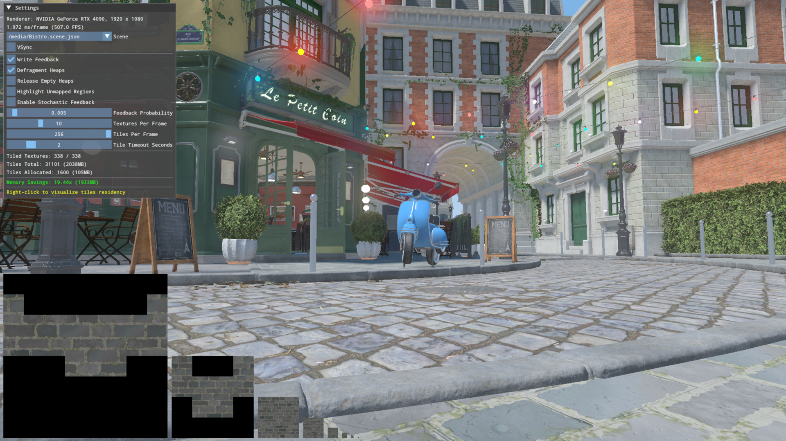

# RTX Texture Streaming SDK v0.7.0 BETA

## Overview

RTX Texture Streaming (RTXTS) is an SDK to provide efficient texture streaming solutions while optimizing storage size and memory bandwidth.

### Distribution

RTXTS is distributed in source code along with a sample, a [runtime library](https://github.com/NVIDIA-RTX/RTXTS-TTM) and an [integration guide](docs/Integration.md).

## Project structure

| Directory               | Details                                                 |
| ----------------------- | ------------------------------------------------------- |
| [/docs](docs)           | _Documentation and integration guide_                   |
| [/libraries](libraries) | _Submodule path for TiledTextureManager_                |
| [/src](src)             | _Sample showcasing usage of RTXTS_                      |
| [/shaders](shaders)     | _Shaders for the sample_                                |
| /media                  | _Media files for the sample (automatically downloaded)_ |

## Building the sample

Requirements:

- Windows 11 SDK
- CMake
- Microsoft Visual Studio 2022 or Microsoft Visual Studio Code with a CMake extension
- A DirectX 12 capable GPU with [Sampler Feedback](https://microsoft.github.io/DirectX-Specs/d3d/SamplerFeedback.html) support
- This SDK does not currently support Vulkan API due to a lack of sampler feedback support

How to Build:

- This repository uses Git submodules. Ensure the submodules have been populated with `git submodule update --init --recursive`
- Use CMake to generate the Visual Studio solution or load the project in VS Code
- During the build configuration CMake will attempt download the required media assets automatically
  - Media are acquired from https://github.com/NVIDIA-RTX/RTXGI-Assets
- Build the solution

## Running the sample

Run the `rtxts-sample` project. The sample will look for scenes in the `media` subfolder and by default will try to load `/media/Bistro.scene.json`

Once the application is running, most of the SDK settings can be accessed via the UI window on the left hand side. The camera can be moved using W/S/A/D keys and rotated by dragging with the left mouse cursor. Press shift while moving to increase speed. Right click on a material in the scene to bring up a visualization of the albedo texture mip chain and its currently allocated state.

The "Memory Savings" stat in the sample represents the amount of memory saved by allocating only the requested tiles, versus all tiles in all loaded textures.

The "Texture Sets" checkbox, enabled by default, enables the grouping of textures belonging to the same material, which implies they are using the same texture coordinates in the pixel shader. These textures will share a Sampler Feedback resource, which reduces the number of `WriteSamplerFeedback` invocations in the shader and the number of Sampler Feedback resources to resolve and read back.

## Notes and known issues

- Currently, only block compressed textures are supported for tiled resources. This is a limitation in the sample code, not of any of the used APIs.
- The G-Buffer rendering pixel shader is annotated with `[earlydepthstencil]`. This is currently required to preserve Early-Z acceleration in the presence of `WriteSamplerFeedback` usage.
- The sample is mainly intended to demonstrate RTX Texture Streaming and might not load or render all GLTF scenes correctly.

## Support

Please report any issues directly through the GitHub issue tracker, and for any information or suggestions contact us at rtxts-sdk-support@nvidia.com

## License

[NVIDIA RTX SDKs LICENSE](license.txt)
